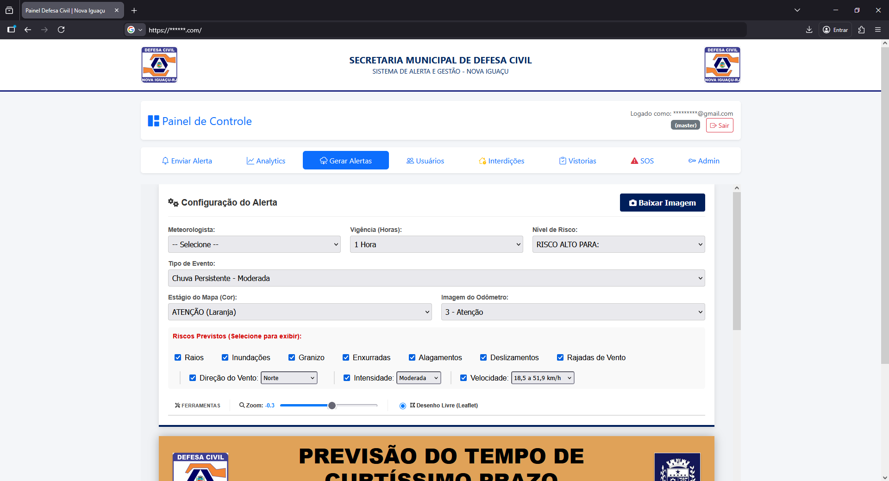
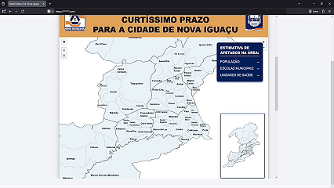
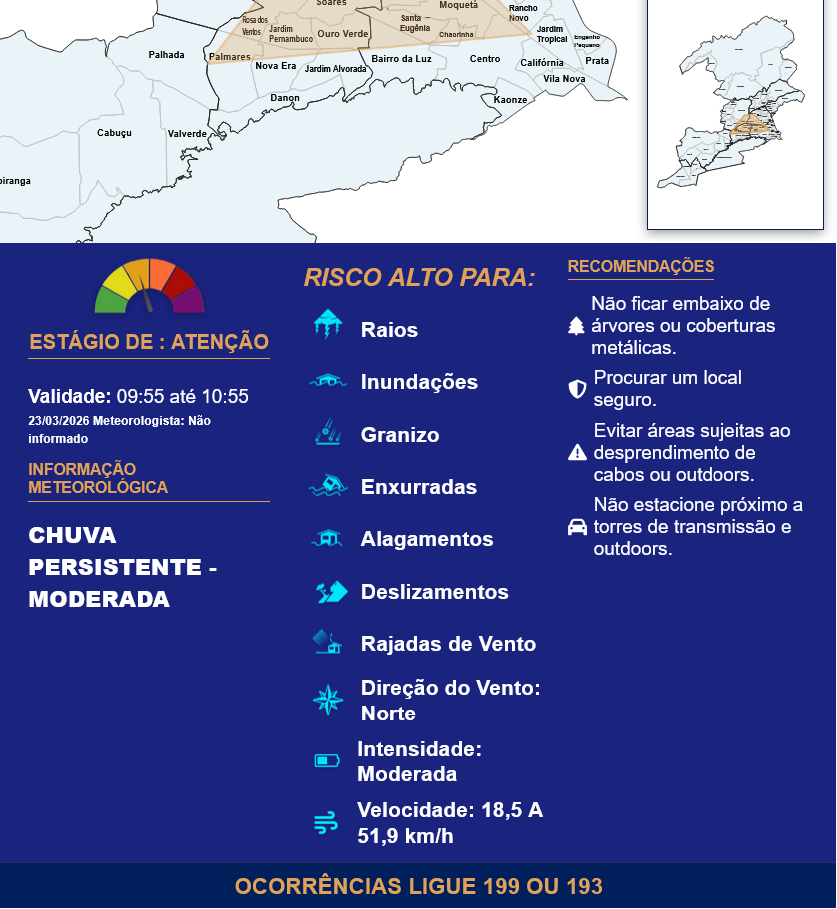
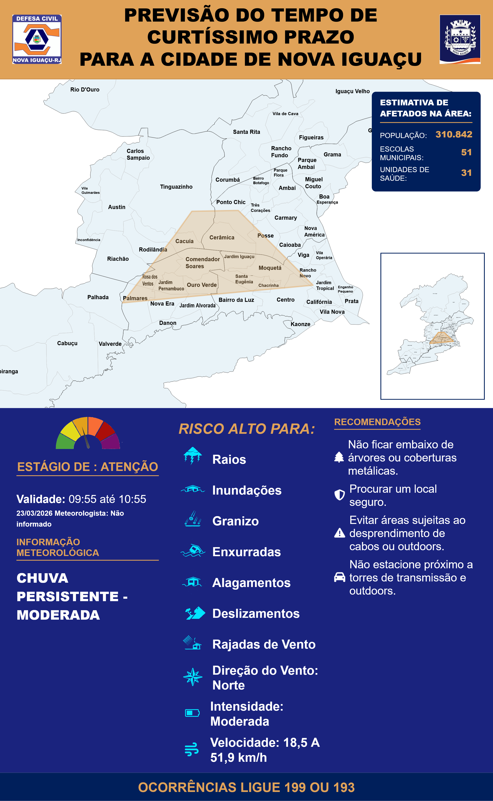

# ⛈️ Gerador de Alertas Meteorológicos - Defesa Civil (Painel de Inteligência)
Ferramenta de geração automática de alertas meteorológicos georreferenciados e estimativa de impactos demográficos para a Defesa Civil de Nova Iguaçu.

> **Nota:** Este é um repositório de portfólio. O código-fonte é propriedade privada e/ou de uso restrito governamental, portanto, apenas a documentação técnica e demonstração de funcionalidades estão disponíveis aqui.

## 🎯 Sobre o Projeto

Desenvolvido para a **Defesa Civil de Nova Iguaçu**, este sistema é uma aplicação web *single-page* (SPA) projetada para agilizar a criação, padronização e análise de comunicados de riscos meteorológicos em tempo real.

Antes desta ferramenta, a criação de alertas dependia de edição manual de imagens, sem inteligência de dados. O sistema automatiza a formatação visual e cruza áreas de risco desenhadas no mapa com dados demográficos da cidade, garantindo precisão técnica em situações de emergência.

## ✨ Novidades da Última Versão
* **Inteligência Geoespacial (Estimativa de Impacto):** Agora o sistema calcula em tempo real a população, escolas municipais e unidades de saúde afetadas dentro do polígono de risco desenhado pelo operador.
* **Barra de Ferramentas Compacta:** Nova UI para controle de mapa, incluindo ajuste fino de zoom decimal e alternância rápida de ferramentas de desenho.
* **Deploy Otimizado:** Configuração de headers de cache no Firebase para garantir atualizações instantâneas da interface em ambiente de produção (Cache Busting).

## 📸 Demonstração

*Interface de configuração mostrando o painel de controle e cruzamento de dados demográficos.*

*Interface de configuração mostrando o mapa interativo e desenho de polígonos.*

 *Interface mostrando a legenda do alerta em tempo real.*

### Resultado Final (Exportação)

*Exemplo de imagem gerada automaticamente pelo sistema, pronta para disparo em redes sociais e WhatsApp.*

## 🚀 Funcionalidades Principais

* **Análise Geoespacial de Risco (Turf.js):**
    * Cálculo de interseção de polígonos complexos cruzando a área de alerta com a base de dados em formato GeoJSON dos bairros da cidade.
    * Atualização dinâmica da estimativa de impacto demográfico (População, Escolas, Hospitais).
* **Mapeamento Interativo Avançado:**
    * Utilização da biblioteca **Leaflet.js** para renderização de mapas com controle de zoom de precisão (frações decimais).
    * **Sincronização de Mini-Mapa:** Um algoritmo personalizado sincroniza o desenho do mapa principal com um mini-mapa estático aninhado no layout final.
* **Tematização Dinâmica:**
    * O sistema altera todo o esquema de cores (CSS Variables), elementos da interface e odômetro de risco automaticamente com base no estágio selecionado (Vigilância, Observação, Atenção, Alerta, Alerta Máximo).
* **Automação de Recomendações:**
    * Lógica condicional que sugere recomendações de segurança baseadas no tipo de evento e na intensidade dos ventos/chuva.
* **Exportação Client-Side (Zero Backend):**
    * Renderização do DOM inteiro em um arquivo de imagem (`.png`) de alta resolução via **html2canvas**, ocultando automaticamente controles de interface durante o "snapshot".

## 🛠️ Tecnologias e Desafios Técnicos

### Stack
* **Front-end:** HTML5, CSS3 (Variáveis Dinâmicas & Flexbox), Vanilla JavaScript (ES6+).
* **Geoprocessamento (GIS):** Leaflet.js, Leaflet Draw, Turf.js.
* **Processamento de Imagem:** html2canvas.
* **Hospedagem:** Firebase Hosting.

### Destaques da Implementação (Engenharia)
Destaco os seguintes desafios arquiteturais resolvidos neste projeto:

1.  **Cálculo de Interseção Espacial no Front-end:** Processar matrizes de coordenadas complexas e calcular a interseção (`turf.booleanIntersects`) entre o desenho do usuário e o GeoJSON da cidade de forma instantânea, sem travar a thread principal do navegador.
2.  **Manipulação de Canvas Assíncrona:** Garantir que elementos dinâmicos do Leaflet fossem preservados pelo `html2canvas` sem artefatos visuais. Foi criada uma lógica de temporização (`setTimeout`) e injeção/remoção de estilos via DOM para ocultar controles nativos antes do *print* da tela.
3.  **Controle Estrito de Cache em SPA:** Configuração avançada do `firebase.json` (`Cache-Control: no-cache, no-store, must-revalidate`) para evitar que CDNs entregassem versões com CSS/JS desatualizados durante o uso em crises meteorológicas críticas.

## 👤 Autor

**Lucas Nunes**
*Desenvolvedor Full Stack & Mobile*

Construindo soluções tecnológicas robustas e escaláveis para desafios reais. Entre em contato para discutir sobre a arquitetura deste projeto ou oportunidades.

